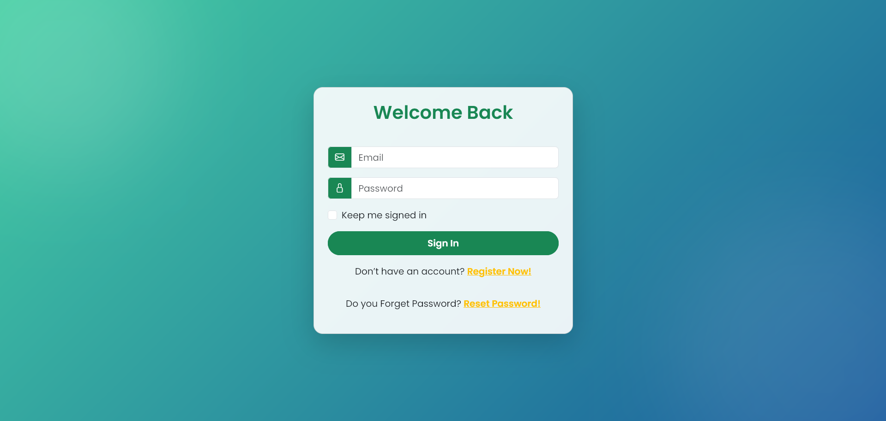
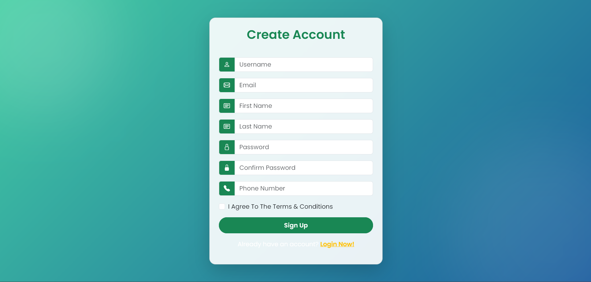
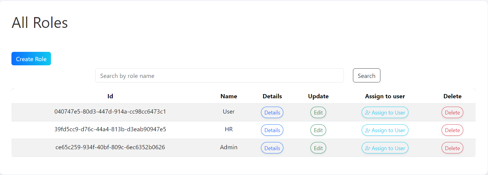
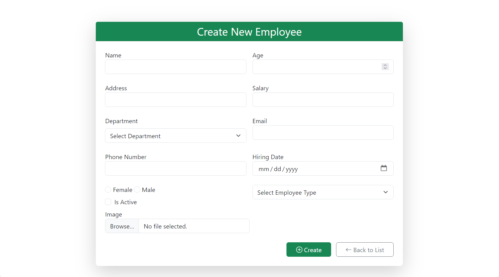

# 💼 ManagementSystem 

[](#license)  
[](#) <!-- replace with real CI badge -->
[](#)

> A modern **ASP.NET Core MVC** application for managing employees and departments.  
> Built with a 3-layer architecture (Presentation / BLL / DAL), ASP.NET Identity, and a polished responsive UI.

---

## 🔎 Quick demo

> Add screenshots inside `/assets` and reference them below.

  

Live demo: **(add link here after deployment)**

---

## ✨ Features

- CRUD for **Employees** (photo upload, edit, delete)
- CRUD for **Departments**
- Department select list when creating/updating employees
- Search, filter and pagination (when needed)
- Authentication & Authorization via **ASP.NET Identity**
  - Register, Login, Logout, Forgot/Reset password
  - Roles (Admin, HR, etc.) with `UserManager` & `RoleManager`
  - Role-based access control (custom authorizations)
- Architecture & patterns:
  - 3-Layer (Presentation / BLL / DAL)
  - Repository + Generic Repository + Unit of Work
  - DTOs, AutoMapper (plus some manual mappings)
- Clean UI/UX: Bootstrap 5, responsive layout, baby-blue theme, polished Navbar & Footer

---

## 🧩 Tech stack

- .NET 9 / ASP.NET Core MVC
- Entity Framework Core (SQL Server)
- ASP.NET Core Identity
- AutoMapper
- Bootstrap 5 + Bootstrap Icons
- jQuery (light use) and small custom JS
- (Optional) Docker & GitHub Actions for CI

---

## 🧰 Prerequisites

- [.NET 9 SDK](https://dotnet.microsoft.com/download)
- SQL Server (LocalDB, SQL Express, or full SQL Server)
- Optional: Docker (for containerized runs)
- Optional: Visual Studio 2022/2023 or VS Code

---

## 🚀 Getting started (local)

1. **Clone**

bash
git clone https://github.com/Eslamrabei/ManagmentSystem.git
cd ManagmentSystem


```
## Project structure

/DemoSolution
/Demo.PL # Presentation - Controllers, Views, wwwroot
/Demo.BLL # Business logic - Services, DTOs, Mapping
/Demo.DAL # Entities, EF Core Context, Repositories
Demo.sln
README.md
.gitignore

```


